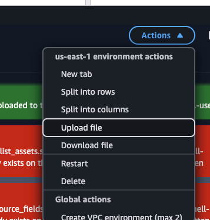
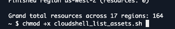
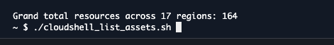
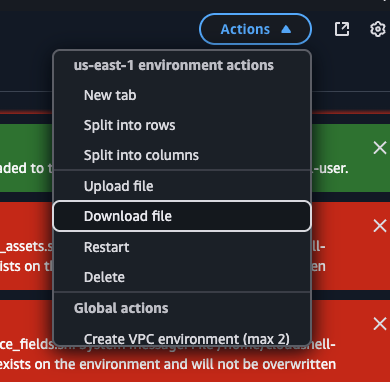

# Phoenix Security AWS On-Boarding Toolkit

A one-stop collection of Infrastructure-as-Code (IaC) assets that enables the core AWS security services – Security Hub, GuardDuty, and Inspector – and provisions a **read-only IAM user** for third-party integrations such as [Phoenix Security](https://www.phoenix.security/).

The repository offers two flavours:

1. **CloudFormation** – single YAML template (`phoenix_security_hub_setup.yaml`).
2. **Terraform** – self-contained module (`aws_phoenix_security_integration.tf`).

Pick whichever aligns with your workflow – both render the same end-state.

---

## Table of Contents

1. [Architecture](#architecture)
2. [Prerequisites](#prerequisites)
3. [Quick Start](#quick-start)
   1. [CloudFormation](#1-cloudformation)
   2. [Terraform](#2-terraform)
4. [Input Variables](#input-variables)
5. [Outputs](#outputs)
6. [Security Notes](#security-notes)
7. [Cleanup / Teardown](#cleanup--teardown)
8. [Cost Considerations](#cost-considerations)
9. [Contributing](#contributing)
10. [License](#license)

---

## Architecture

The stack performs the following actions in your AWS account/region:

* **Enable Security Hub** – foundational security findings aggregation.
* **Activate Amazon Inspector V2** – continuous vulnerability scanning for EC2 & ECR.
* **Enable GuardDuty** – threat-detection service for malicious activity and anomalies.
* **Create an IAM user** named `phoenix-security-reader` with the **`SecurityAudit`** managed policy attached (read-only across most AWS services).
* Generates an **access-key / secret-key** pair and returns them as stack/module outputs.

> Note: All resources are created in the region you specify (default examples use `us-east-1`). Security Hub and GuardDuty pricing is regional; feel free to replicate only in the regions you actually use.

---

## Prerequisites

1. **AWS Account** – permissions to create IAM users, enable GuardDuty/Inspector/Security Hub.
2. **Command-line tooling**
   * [AWS CLI](https://docs.aws.amazon.com/cli/latest/userguide/getting-started-install.html) v2 configured (`aws configure`).
   * [Terraform](https://developer.hashicorp.com/terraform/downloads) v1.0+ (if you pick the TF path).
3. **Credentials** – either
   * environment variables (`AWS_ACCESS_KEY_ID`/`AWS_SECRET_ACCESS_KEY`/`AWS_SESSION_TOKEN`), or
   * an IAM role in your workstation (e.g., via AWS SSO or STS `assume-role`).

---

## Quick Start

### 1. CloudFormation

#### Console (UI)

1. Sign in to the AWS Console in your target region.
2. Navigate to **CloudFormation → Stacks → Create stack → With new resources (standard)**.
3. Upload or paste `phoenix_security_hub_setup.yaml`.
4. Click **Next** → accept defaults → **Create stack**.
5. Wait until status is **`CREATE_COMPLETE`** (≈ 2–3 minutes).
6. Retrieve the **`AccessKeyID`** and **`SecretAccessKey`** from the *Outputs* tab.

#### CLI

```bash
aws cloudformation create-stack \
  --stack-name phoenix-security-onboarding \
  --template-body file://phoenix_security_hub_setup.yaml \
  --capabilities CAPABILITY_NAMED_IAM

# watch status
aws cloudformation wait stack-create-complete --stack-name phoenix-security-onboarding

# fetch outputs
aws cloudformation describe-stacks --stack-name phoenix-security-onboarding \
  --query "Stacks[0].Outputs[].[OutputKey,OutputValue]" --output table
```

### 2. Terraform

```bash
# clone repository
 git clone https://github.com/<your-org>/Phoenix-security-onboarding.git
 cd Phoenix-security-onboarding

# (Option A) Use environment variables for AWS creds
 export AWS_ACCESS_KEY_ID=...;
 export AWS_SECRET_ACCESS_KEY=...;
 export AWS_DEFAULT_REGION=us-east-1;

# (Option B) Pass a different set of creds to create the read-only user via TF variables
# **Only** necessary if you are targeting a *different* account than your default profile.

# create a terraform.tfvars file or pass -var flags
cat <<EOF >terraform.tfvars
region      = "us-east-1"
account_id  = "123456789012"
# Optional – overrides default credential chain
# access_key = "AKIA..."
# secret_key = "wJalrXUtnFEMI/K7MDENG/bPxRfiCY..."
EOF

terraform init
terraform plan   # review changes
terraform apply  # type 'yes' to confirm

# Output:
# aws_access_key_id     = "AKIA..."
# aws_secret_access_key = "<sensitive>"
```

---

## Input Variables

| Variable      | Description                                | Type | Required |
|---------------|--------------------------------------------|------|----------|
| `region`      | AWS region where services are enabled      | `string` | yes |
| `account_id`  | 12-digit AWS account ID                    | `string` | yes |
| `access_key`  | (TF only) Access key of the *admin/creator* account. Leave blank to use default credential chain. | `string` | no |
| `secret_key`  | (TF only) Secret key corresponding to `access_key` | `string` | no |

---

## Outputs

| Output                    | Description                                   |
|---------------------------|-----------------------------------------------|
| `aws_access_key_id` / `AccessKeyID` | Access key ID of the read-only user |
| `aws_secret_access_key` / `SecretAccessKey` | Secret access key (sensitive) |

*Keep these values secret – they grant read-only access across your account.*

---

## Security Notes

1. **Least Privilege** – the IAM user is granted the AWS-managed `SecurityAudit` policy (read-only). Modify if you need narrower scope.
2. **Credential Storage** – the secret access key appears:
   * in Terraform state (`terraform.tfstate`), and
   * in CloudFormation *Outputs*.

   Protect state files (e.g., store in **S3 + KMS encryption** with access-controls) and restrict CloudFormation console access.
3. **Key Rotation** – rotate or delete the generated key when you no longer need it. You can create a second key and then delete the first to minimise downtime.
4. **Logging & Monitoring** – enable CloudTrail and review GuardDuty findings to detect anomalous API calls by the read-only user.
5. **Costs & Quotas** – Security Hub, Inspector, and GuardDuty incur charges per region and per resource. Review the [AWS pricing pages](https://aws.amazon.com/pricing/) and disable services in unused regions.

---

## Cleanup / Teardown

* **CloudFormation** – `Delete stack` from the console or:
  ```bash
  aws cloudformation delete-stack --stack-name phoenix-security-onboarding
  ```
  This removes all resources including the IAM user and access keys.

* **Terraform** – from the repo directory:
  ```bash
  terraform destroy
  ```
  Confirm with `yes`. Terraform removes everything it created.

> ⚠️  GuardDuty and Inspector may keep historical findings for a short period after deactivation; charges cease once detectors/scanners are disabled.

---

## Cost Considerations

While most AWS security services have free tiers, real-world usage generally incurs monthly costs:

* **Security Hub** – $0.0010 per compliance check and per finding. Charged per account/region.
* **GuardDuty** – Varies by data analysed; median small accounts are ▲$1–4/month.
* **Inspector V2** – Charged per compute/container image scan.

Deploy only in the regions you actively use to limit spend. Review budgets and forecasts regularly.

---

## Contributing

PRs are welcome! Please submit an issue first if you plan large changes so we can discuss the approach.

---

## License

Distributed under the MIT License. See `LICENSE` for more information.

## Asset Enumeration with CloudShell

Need a quick inventory of everything in your AWS account? The helper script `cloudshell_list_assets.sh` (in this folder) works directly inside **AWS CloudShell**.

### Prerequisites

* Logged into CloudShell with an IAM identity that has **`tag:GetResources`** permissions (AWS-managed policy `ReadOnlyAccess` is sufficient).
* `jq` utility (usually pre-installed; install with `sudo yum -y install jq` if missing).

### Usage

1. **Log into AWS Console** and open CloudShell
2. **Upload the script** using the CloudShell file upload feature:

   

3. **Set proper permissions** and run the enumeration:

   

```bash
# Clone or copy the script first
chmod +x cloudshell_list_assets.sh

# Enumerate ALL commercial regions
./cloudshell_list_assets.sh

# Enumerate only selected regions
./cloudshell_list_assets.sh us-east-1 eu-west-1

# Save output to a file for later analysis
./cloudshell_list_assets.sh > assets.txt
```

What you'll see:

* A spinner indicating progress per region.
* Every taggable resource's ARN printed line-by-line.
* A per-region count and a final **grand total**.



> The Resource Groups Tagging API returns only *taggable* resources. Non-taggable objects like IAM roles or Route 53 zones aren't included.


if the output is too long:
 ./cloudshell_list_assets.sh > asset_for_phoenix.txt

then downlaod the file 

   
